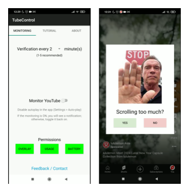

# TubeControl

This is a small project created by a beginner to develop an Android application to help people scrolling on YouTube. The purpose of this repository is to showcase what I have tried building.

The app will run in the background and check if YouTube is active in portrait mode with high activity levels. When appropriate, a pop-up will be displayed. 

---

## App Screenshots  
  

---

## Code Overview  
- **Backend (Kotlin):** Located in the `app/src/main/java/fr/youtubedetector` folder.  
- **Frontend (XML):** Located in the `app/src/main/res/layout` folder.  

---

## Notes  
- Relatively functional on a Redmi Note 7.  
- Not functional on more recent phones due to issues with the required permissions.  

---
